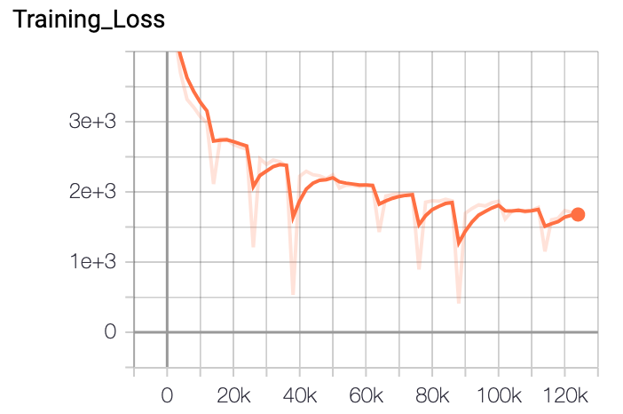
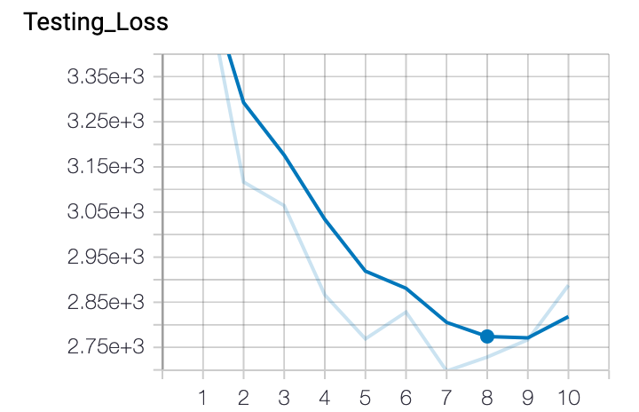
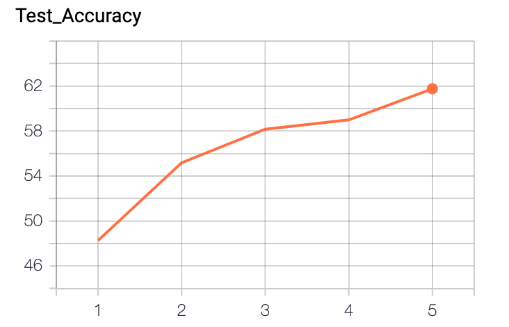

# Image Classification using Pytorch

### List of Datasets
* CIFAR10
* MNIST (coming up)

### Architecture
* Convolution Neural Network

### Requirements
* Python 3.6.10  
* Numpy 1.18.4  
* Tensorboard 2.0.0  
* Tensorflow 2.0.0  
* Pytorch 1.5.0  
* Torchvision 0.6.0  

### Results
* CIFAR10 : command with parameters(dataset, model)
          

confusion matrix

